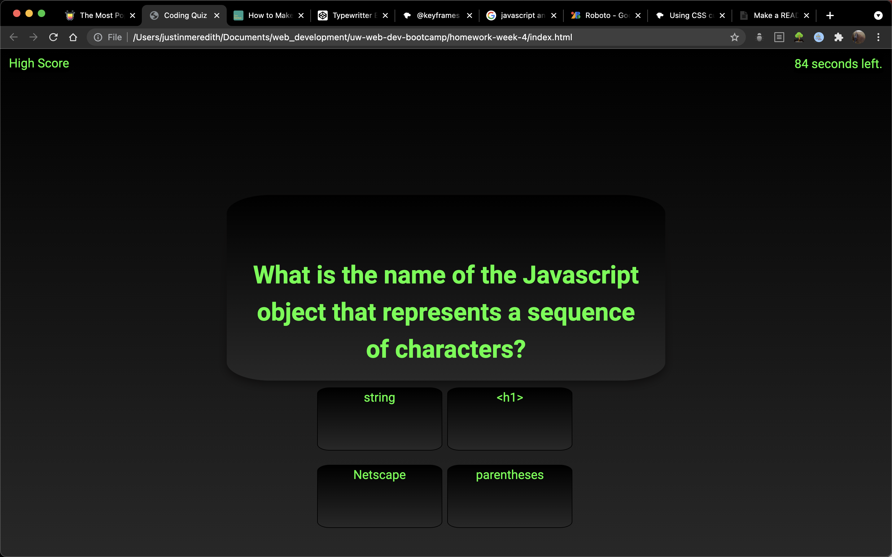

#Javascript Coding Quiz

This is a javascript quiz project for the University of Washington coding bootcamp.

##Functionality

On load, the page describes the quiz and invites you to play by pressing the start button.
The quiz takes you through 10 questions, and offers one point for each correct answer.
Each question is displayed on the page, and the user can choose between 4 multiple choice options to answer the question.
There is a 100 second timer. Each incorrect answer incurs a ten second penalty upon the user.
At the end of the quiz, the user is invited to input their initials to be stored locally with their score if it is the highest.
The highest score is then displayed. The high score can also be viewed by pressing the button marked 'High Score'.

##Screenshot

Here is a screenshot of the quiz:

##Deployed Site

Check out a deployed version here: https://justinm099.github.io/javascript-quiz/

##Contact

Thanks for reading! If you have any questions, please feel free to reach out! justinm099@mac.com

